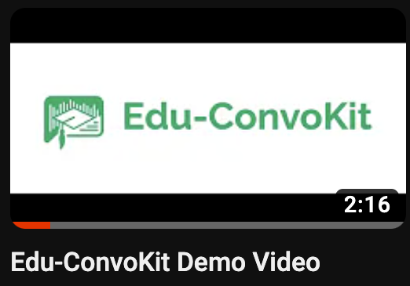

<p align="center">
  
</p>

<h1> Edu-ConvoKit: An Open-Source Framework for Education Conversation Data </h1>

**Accepted to NAACL 2024, Systems Track**

The **Edu-ConvoKit** is an open-source framework designed to facilitate the study of conversation language data in educational settings.
It provides a practical and efficient pipeline for essential tasks such as text pre-processing, annotation, and analysis, tailored to meet the needs of researchers and developers.
This toolkit aims to enhance the accessibility and reproducibility of educational language data analysis, as well as advance both natural language processing (NLP) and education research.
By simplifying these key operations, the Edu-ConvoKit supports the efficient exploration and interpretation of text data in education.

Our publication on Edu-ConvoKit can be found here: https://arxiv.org/pdf/2402.05111.pdf

## 📖 Table of Contents
[**Installation**](#installation) | [**Tutorials**](#tutorials) | [**Example Usage**](#example-usage) | [**Documentation**](https://edu-convokit.readthedocs.io/en/latest/) | [**Papers with Edu-ConvoKit**](papers.md) | [**Citation**](#citation) | [**Future Extensions**](#future-features) | [**Contributing**]() | [**Contact**](#contact)

## Installation

You can install `edu-convokit` with pip:

```bash

pip install edu-convokit

```

## Overview of the `Edu-ConvoKit` Pipeline

The **Edu-ConvoKit** pipeline consists of three key modules: `preprocess`, `annotate`, and `analyze`.
The pipeline is designed to be modular, so you can use any combination of these modules to suit your needs.
This pipeline has also been used by prior work in the field of education, so you can easily reproduce their results. 

<p align="center">
  
</p>

## Tutorials

We have provided a series of tutorials to help you get started with the `Edu-ConvoKit`.

### Demo Video

Here is a 2-minute demo of what `Edu-ConvoKit` can do.


<p>
  <a href="https://youtu.be/zdcI839vAko?si=yOOgiBAR3wIdE5IV">
    
  </a>
</p>


### Basics of `Edu-ConvoKit`

There are three key modules of the `Edu-ConvoKit` pipeline: `preprocess`, `annotate`, and `analyze`.

* [][textcolab] [Tutorial: Text Pre-processing][textcolab]
* [][annotationcolab] [Tutorial: Annotation][annotationcolab]
* [][analyzecolab] [Tutorial: Analysis][analyzecolab]
...

### Datasets with `Edu-ConvoKit`

We've applied the `Edu-ConvoKit` to a variety of datasets. Here are some examples:
* [][nctecolab] [Tutorial: NCTE Dataset][nctecolab]
* [][ambercolab] [Tutorial: Amber Dataset][ambercolab]
* [][talkmovescolab] [Tutorial: Talk Moves Dataset][talkmovescolab]


## Example Usage

Contents:
- [Pre-Processing](#pre-processing)
- [Annotation](#annotation)
- [Analysis](#analysis)
  - [Qualitative Analysis](#-qualitative-analysis)
  - [Quantitative Analysis](#-quantitative-analysis)
  - [Lexical Analysis](#-lexical-analysis)
  - [Temporal Analysis](#-temporal-analysis)
  - [GPT Analysis](#-gpt-analysis)


### Pre-Processing

The `preprocess` module provides a set of tools for cleaning and formatting raw text data. Text pre-processing is a critical step in handling education language data. 
- It ensures the data is clean (education data is notoriously messy). 
- It ensures the data is standardized, ready for annotation and analysis. 
- It ensures that the students and educators are anonymized; this is important to protect the privacy of individuals involved and allow for safe secondary data analysis.

Here's an example of using `preprocess` to anonymize the dataset with known names:

```python 

>> from edu_convokit.preprocessors import TextPreprocessor
# For helping us flexibly load data
>> from edu_convokit import utils

# First get the data
>> !wget "https://raw.githubusercontent.com/rosewang2008/edu-convokit/master/data/talkmoves/Boats and Fish 2_Grade 4.xlsx"
>> data_fname = "Boats and Fish 2_Grade 4.xlsx"
>> df = utils.load_data(data_fname) # Handles loading data from different file types including: .csv, .xlsx, .json

# Show some lines that contain names in the speaker and text columns.
>> df.iloc[25:35]
```

<p align="center">
  
</p>

💡 Note: We see that the names occur in the speaker and text column. 
- e.g., names like David and Meredith appear in the speaker and text column. 
- The teacher is always shortened to “T” in the speaker column.

We can use the `TextPreprocessor` to anonymize the data in both columns.

```python

# Creating variables for the columns we want to use
>> TEXT_COLUMN = "Sentence"
>> SPEAKER_COLUMN = "Speaker"

# Show the names of the speakers. In your use case, you might load this from a file or database.
>> print(df[SPEAKER_COLUMN].unique())
['T' 'David' 'Meredith' 'Beth' 'Meredith and David' 'T 2']

# Create list of names and replacement names. We will make the replacement names unique so that we can easily find them later.
>> known_names = ["David", "Meredith", "Beth"]
>> known_replacement_names = [f"[STUDENT_{i}]" for i in range(len(known_names))]
>> print(known_replacement_names)
['[STUDENT_0]', '[STUDENT_1]', '[STUDENT_2]']

# Now let's anonymize the names in the text!
>> processor = TextPreprocessor()
>> df = processor.anonymize_known_names(
    df=df,
    text_column=TEXT_COLUMN,
    names=known_names,
    replacement_names=known_replacement_names,
    # We will directly replace the names in the text column.
    # If you want to keep the original text, you can set `target_text_column` to a new column name.
    target_text_column=TEXT_COLUMN
)
>> df.iloc[25:35]
```

<p align="center">
  
</p>

💡 Note: Nice, we can see that the text has been anonymized (e.g., line 31)! Now let's anonymize the names in the speaker column.

```python

df = processor.anonymize_known_names(
    df=df,
    text_column=SPEAKER_COLUMN,
    names=known_names,
    replacement_names=known_replacement_names,
    target_text_column=SPEAKER_COLUMN
)

df.iloc[25:35]
```

<p align="center">
  
</p>

🎉 Great, now we have anonymized the speaker names as well! Some other great things are that: 
- We have a record of the original names and the anonymized names. So if we want to go back to the original names, we can do that. 
- The anonymized names are consistent: So [STUDENT_0] in the SPEAKER_COLUMN will refer to the same [STUDENT_0] in the TEXT_COLUMN.

We can also use the `TextPreprocessor` to group the utterances from the same speaker together.

```python
df = processor.merge_utterances_from_same_speaker(
    df=df,
    text_column=TEXT_COLUMN,
    speaker_column=SPEAKER_COLUMN,
    # We're going to directly replace the text in the text column.
    target_text_column=TEXT_COLUMN
)

df.iloc[25:35]
```

<p align="center">
  
</p>

### Annotation

Annotation is a critical step in understanding your data, and it is important to do it right and consistently across datasets. 
Annotation is useful because: 
- It creates descriptive statistics about your data, which can help you understand the data. 
- It quantifies the language used by your students and educators, which can help you understand the language. 
- It measures the interaction between the student and the educator, which can help you understand the interaction.

Edu-ConvoKit is designed to support these purposes with the `annotator` module. 
Here's an example of using `annotator` to annotate the dataset for talktime, student reasoning, and teacher conversational uptake.
We're going to use the same dataframe from the previous example; so `df` will be the dataframe with anonymized names and merged utterances.

```python

>> from edu_convokit.annotation import Annotator
>> annotator = Annotator()

# The talktime values will be populated in this column
>> TALK_TIME_COLUMN = "talktime"
>> df = annotator.get_talktime(
    df=df,
    text_column=TEXT_COLUMN,
    analysis_unit="words",
    output_column=TALK_TIME_COLUMN
)

df.head()
```

<p align="center">
  
</p>

🎉 We can see with a single function call, we’ve added our first annotation – talktime – to our data!

Let's do the same for student reasoning and teacher conversational uptake.

```python

# The reasoning annotations will be populated in this column
>> STUDENT_REASONING_COLUMN = "student_reasoning"
>> df = annotator.get_student_reasoning(
    df=df,
    speaker_column=SPEAKER_COLUMN,
    text_column=TEXT_COLUMN,
    output_column=STUDENT_REASONING_COLUMN,
    # Since this model is only trained on _student_ utterances,
    # we can explicitly pass in the speaker names associated to students.
    # It will only annotate utterances from these speakers.
    speaker_value=known_replacement_names,
)

# The uptake annotations will be populated in this column.
>> UPTAKE_COLUMN = "uptake"
>> df = annotator.get_uptake(
    df=df,
    speaker_column=SPEAKER_COLUMN,
    text_column=TEXT_COLUMN,
    output_column=UPTAKE_COLUMN,
    # Conversation uptake is about how much the teacher builds on what the students say.
    # So, we want to specify the first speaker to be the students.
    speaker1=known_replacement_names,
    # And the second speaker to be the teacher.
    speaker2='T'
)
>> df.head(20)
```

<p align="center">
  
</p>

With these annotations, we can now do some analysis on our data. We can save the annotated data to a file for later use.

```python

>> df.to_csv("annotated_data.csv", index=False)
```

### Analysis

Analyzing your data with `Edu-ConvoKit` can help you understand the language used by your students and educators.
Analysis on education data can happen in many ways. 
- 🔍 It can happen qualitatively where you look at the data; for example, we annotated the data for student_reasoning and you might be interested in looking at the specific instances of student reasoning. 
- 📊 It can also happen quantitatively where you look at the data in aggregate; for example, you might be interested in the average amount of time the student and educator talk. 
- 💬 You might be interested in lexically analyzing the data; for example, you might be interested in what words the student uses the most compared to the educator. 
- 📈 You might be interested in temporally analyzing the data; for example, you might be interested in the amount of time the student and educator talk over the course of their interaction.
- 🤖 You might also be interested in using **GPT** to analyze the data; for example, you might want GPT4 to summarize the transcript.

Here's an example of using `analyzer` for each for these analysis types. We'll be using the same dataframe from the previous example; so `df` will be the dataframe with annotations.

#### 🔍 Qualitative Analysis

Let’s start by looking at the data qualitatively. We will use the `QualitativeAnalyzer` to look at the data.
Ever wondered whether there was a quick way to … 
- Look at examples of student reasoning? 
- Look at examples of high conversational uptake by the educator?

This is where the `QualitativeAnalyzer` comes in handy!

Let's look at some examples of student reasoning.

```python

>> from edu_convokit.analyzers import QualitativeAnalyzer,
>> qual_analyzer = QualitativeAnalyzer()

>> qual_analyzer.print_examples(
    df=df,
    speaker_column=SPEAKER_COLUMN,
    text_column=TEXT_COLUMN,
    # We want to look at examples for the reasoning feature
    feature_column=STUDENT_REASONING_COLUMN,
    # We want to look at positive examples of reasoning
    feature_value=1.0,
    # Let's look at 3 examples
    max_num_examples=3
)
student_reasoning: 1.0
>> [STUDENT_1]: one half by one sixth. Cause if you put six ones up to a whole

student_reasoning: 1.0
>> [STUDENT_0]: This would be one third, and this is one half of  dark green, and then it would be bigger by one sixth, because

student_reasoning: 1.0
>> [STUDENT_1]: I mean it's bigger than one tenth, I mean twelfth, one twelfth, one  twelfth.
```

🎉 Great! This is a quick way to look at examples of student reasoning.

If you’re curious in looking at the preceding and succeeding utterances (for context), you can easily do that by specifying the number of lines:

```python

>> qual_analyzer.print_examples(
    df=df,
    speaker_column=SPEAKER_COLUMN,
    text_column=TEXT_COLUMN,
    feature_column=STUDENT_REASONING_COLUMN,
    feature_value=1.0,
    max_num_examples=3,
    # We want to look at the previous 2 lines of context
    show_k_previous_lines=2,
    # We also want to look at the next 1 line of context
    show_k_next_lines=1
)

student_reasoning: 1.0
[STUDENT_1] and [STUDENT_0]: is bigger than
T: You both agree?
>> [STUDENT_1]: one half by one sixth. Cause if you put six ones up to a whole
[STUDENT_0]: dark green

student_reasoning: 1.0
T: Ok
[STUDENT_1]: So there’s six sixths
>> [STUDENT_0]: This would be one third, and this is one half of  dark green, and then it would be bigger by one sixth, because
T: Do you both agree with that?

student_reasoning: 1.0
[STUDENT_1]: Yeah, and you take the two dark green rods, those are the halves... And you take two  thirds, and put it up to it, and you take... two sixths, it's bigger than  two sixths. And  in this one, it you take this ...
T 2: Can we go back to that one again?
>> [STUDENT_1]: I mean it's bigger than one tenth, I mean twelfth, one twelfth, one  twelfth.
T 2: How does that work? I'm confused about that. I’m confused about  the little white rods, I am following you right up to that point.

```

🎉 Awesome! Another handy way to use QualitativeAnalyzer is to look at both positive and negative examples of student reasoning. You can do that by omitting the feature values specification:

```python

>> qual_analyzer.print_examples(
    df=df,
    speaker_column=SPEAKER_COLUMN,
    text_column=TEXT_COLUMN,
    feature_column=STUDENT_REASONING_COLUMN,
    max_num_examples=3,
    show_k_previous_lines=2,
    show_k_next_lines=1,
    # feature_value="1.0", Omitted!
)
student_reasoning: 0.0
T: I'm wondering which is bigger, one half or two thirds. Now  before you model it you might think in your head, before you begin  to model it what you is bigger and if so, if one is bigger, by how  much. Why don’t you work with your partner and see what you can  do.
>> [STUDENT_0]: Try the purples. Get three purples. It doesn’t work, try the greens
[STUDENT_1]: What was it? Two thirds?

student_reasoning: 0.0
[STUDENT_0]: Try the purples. Get three purples. It doesn’t work, try the greens
[STUDENT_1]: What was it? Two thirds?
>> [STUDENT_0]: It would be like brown or something like that.
[STUDENT_1]: Ok

student_reasoning: 0.0
[STUDENT_0]: It would be like brown or something like that.
[STUDENT_1]: Ok
>> [STUDENT_0]: We’re not doing the one third, we’re doing two thirds. That is one  third
[STUDENT_1]: First we’ve got to find out what a third of it is. What’s a third of an  orange?

student_reasoning: 1.0
[STUDENT_1] and [STUDENT_0]: is bigger than
T: You both agree?
>> [STUDENT_1]: one half by one sixth. Cause if you put six ones up to a whole
[STUDENT_0]: dark green

student_reasoning: 1.0
T: Ok
[STUDENT_1]: So there’s six sixths
>> [STUDENT_0]: This would be one third, and this is one half of  dark green, and then it would be bigger by one sixth, because
T: Do you both agree with that?

student_reasoning: 1.0
[STUDENT_1]: Yeah, and you take the two dark green rods, those are the halves... And you take two  thirds, and put it up to it, and you take... two sixths, it's bigger than  two sixths. And  in this one, it you take this ...
T 2: Can we go back to that one again?
>> [STUDENT_1]: I mean it's bigger than one tenth, I mean twelfth, one twelfth, one  twelfth.
T 2: How does that work? I'm confused about that. I’m confused about  the little white rods, I am following you right up to that point.

```

Looking at examples of other annotations is similar---just specify the feature column and feature value.

#### 📊 Quantitative Analysis

Let’s start by looking at the data quantitatively. We will use the `QuantitativeAnalyzer` to look at the data.

Ever wondered whether there was a quick way to report aggregate statistics on: 
- Talk time? 
- Student reasoning? 
- Conversational uptake?

This is where the QuantitativeAnalyzer comes in handy!

Let’s say we want to understand the talk time percentage split between the student and educator. We might want to know the statistic and plot the data. Here’s how we can do that:

```python   
>> from edu_convokit.analyzers import QuantitativeAnalyzer
>> analyzer = QuantitativeAnalyzer()
# Create speaker mapping to A, B, C, D
>> label_mapping = {
    speaker: chr(ord('A') + i) for i, speaker in enumerate(df[SPEAKER_COLUMN].unique())
}
>> analyzer.plot_statistics(
    # Everything else is the same
    feature_column=TALK_TIME_COLUMN,
    df=df,
    speaker_column=SPEAKER_COLUMN,
    value_as="prop",
    # We want to use the mapping we created
    label_mapping=label_mapping
)
```

<p align="center">
  
</p>

The other statistics are similar to the example above for talk time. For conciseness, we will omit them here; but the only thing you need to do is change the feature_column argument to the feature you want to analyze.


#### 💬 Lexical Analysis
A lexical analysis is an analysis on the words used in the data. This is useful for understanding the low-level language (i.e., word usage) used by the student and educator. While a lexical analysis may be too low-level for capturing e.g., the meaning of the discourse, it can be a useful first step in capturing language trends in the data.

We will give a simple demonstration of two features of the `LexicalAnalyzer`: 
- Word Frequency: We will look at the most frequent words used by each speaker. 
- Log-Odds: We will look at the log-odds of words used by each speaker (i.e., which words are more likely to be used by the student vs. the educator).

```python

>> from edu_convokit.analyzers import LexicalAnalyzer
>> analyzer = LexicalAnalyzer()

>> analyzer.print_word_frequency(
    df=df,
    text_column=TEXT_COLUMN,
    speaker_column=SPEAKER_COLUMN,
    # We want to look at the top 5 words
    topk=5,
    # We want to format the text e.g., remove punctuation and stopwords (https://en.wikipedia.org/wiki/Stop_word)
    run_text_formatting=True
)
Top Words By Speaker
T
works: 6
one: 5
bigger: 4
models: 4
write: 3


[STUDENT_0]
one: 10
would: 5
third: 4
yeah: 3
bigger: 3


[STUDENT_1]
one: 16
two: 13
take: 9
put: 8
yeah: 8


[STUDENT_2]
one: 1
half: 1


[STUDENT_1] and [STUDENT_0]
well: 1
bigger: 1
one: 1


T 2
one: 9
two: 8
interesting: 5
okay: 4
twelfths: 4
```

💡 We can see that there’s a lot of use of numbers and fractions (“one”, “third”), in addition to comparison language (“bigger”).

If you want to see the most frequent words overall, you can omit the speaker_column argument:

```python

>> analyzer.print_word_frequency(
    df=df,
    text_column=TEXT_COLUMN,
    # Bye! We don't care about the speaker anymore
    # speaker_column=SPEAKER_COLUMN,
    topk=5,
    run_text_formatting=True
)

one: 42
two: 25
bigger: 15
yeah: 12
sixth: 11
```

Let’s now move onto the log-odds analysis.

💡 Why a log-odds analysis?

Going beyond just counting frequent words in the student and teacher’s utterances, we might be interested in the chances of a word occurring in the student’s text over it occurring in the teacher’s text.

This gets us to a log-odds analysis on the words. For more information on log-odds analysis, please refer to this paper which applied the same analysis to study language use in political speeches.

In order to run a log-odds analysis, we need to specify two groups of texts we want to compare to each other. In this case, we are interested in comparing the student’s text to the teacher’s text. So let’s split our original dataframe into these two groups and pass them into the log-odds analysis.

```python

>> speakers = df[SPEAKER_COLUMN].unique()
# Student speakers are ones that contain STUDENT in their name
>> student_speakers = [speaker for speaker in speakers if "STUDENT" in speaker]
# Teacher speakers are all the other speakers
>> teacher_speakers = [speaker for speaker in speakers if speaker not in student_speakers]

# Now let's split the data frame into two data frames: one for student speakers and one for teacher speakers
>> student_df = df[df[SPEAKER_COLUMN].isin(student_speakers)]
>> teacher_df = df[df[SPEAKER_COLUMN].isin(teacher_speakers)]

# We can now run the analyzer:
>> analyzer.print_log_odds(
    df1=student_df,
    df2=teacher_df,
    text_column1=TEXT_COLUMN,
    text_column2=TEXT_COLUMN,
    # We want to look at the top 5 words
    topk=5,
    # We still want to format the text
    run_text_formatting=True
)

Top words for Group 1
put: 1.5082544501223418
yeah: 1.4243179151183505
third: 1.323889968245073
take: 1.2333974083596422
green: 1.1289734037070032


Top words for Group 2
works: -1.5890822958913073
models: -1.5890822958913073
interesting: -1.447190205063502
see: -1.291347559145683
okay: -1.291347559145683
```

🎉 Awesome, this shows us both the words and odds of the words used by the student (Group 1) and educator (Group 2).

We can also plot this with a similar function call:

```python

analyzer.plot_log_odds(
    df1=student_df,
    df2=teacher_df,
    text_column1=TEXT_COLUMN,
    text_column2=TEXT_COLUMN,
    topk=5,
    run_text_formatting=True,
    # We can pass plot labels for group 1 and 2
    group1_name="Student",
    group2_name="Teacher"
)
```

<p align="center">
  
</p>

#### 📈 Temporal Analysis

A temporal analysis is an analysis on the features over time. We define time as the time over the course of the transcript.

Let’s see how we can look at the talk time ratio (which we summarized before quantitatively) over time. This setup will look similar to the quantitative analysis however the key difference is that we will specify a num_bins argument to specify the number of bins we want to split the transcript into.

```python

>> from edu_convokit.analyzers import TemporalAnalyzer
>> analyzer = TemporalAnalyzer()

# We'll use the same label mapping as before to abbreviate the speaker names
>> print(f"Label mapping: {label_mapping}")
Label mapping: {'T': 'A', '[STUDENT_0]': 'B', '[STUDENT_1]': 'C', '[STUDENT_2]': 'D', '[STUDENT_1] and [STUDENT_0]': 'E', 'T 2': 'F'}

>> analyzer.plot_temporal_statistics(
            feature_column=TALK_TIME_COLUMN,
            dfs=df,
            speaker_column=SPEAKER_COLUMN,
            # We want to see the proportion of talk time
            value_as="prop",
            # We will split the session into 5 bins
            num_bins=5,
            # We want to use the mapping we created
            label_mapping=label_mapping
        )
```

<p align="center">
  
</p>

🎉 Plotting the temporal data was straightforward!

💡 There are some interesting observations, for example: 
- Speaker B ([STUDENT_0]) decreases their talk time over time whereas 
- Speaker C (the other student, [STUDENT_1]) has fluctuating talk time over time.

Plotting the other statistics is similar to the example above for talk time. For conciseness, we will omit them here; but the only thing you need to do is change the feature_column argument to the feature you want to analyze.


#### 🤖 GPT Analysis

A GPT analysis is an analysis using GPT (e.g., ChatGPT or GPT4) to analyze the data.
This is useful for understanding the high-level language (i.e., meaning) used by the student and educator. 
While a GPT analysis may be too high-level for capturing e.g., the specific words used by the student and educator, it can be a useful first step in capturing meaning in the data.

Let’s see how we can use GPT to summarize the transcript. We will use the `GPTConversationAnalyzer` to do this. There are other prompts you can use for GPT in [this directory](https://github.com/rosewang2008/edu-convokit/tree/main/edu_convokit/prompts/).

You will first need to set your OpenAI API key as an environment variable.

```python

>> import os
# Remember to never share your API key with anyone!
>> os.environ["OPENAI_API_KEY"] = "YOUR_API_KEY"

```

We can now try to summarize the transcript.

```python

>> from edu_convokit.analyzers import GPTConversationAnalyzer
>> analyzer = GPTConversationAnalyzer()
>> prompt = analyzer.preview_prompt(
            df=df,
            # Using the summarize prompt under prompts/conversation
            prompt_name="summarize",
            text_column=TEXT_COLUMN,
            speaker_column=SPEAKER_COLUMN,
            model="gpt-4",
            format_template="{speaker}: {text}",
        )
>> print(prompt)

Consider the following transcript of a conversation between a teacher and a student.

Transcript:
T: I'm wondering which is bigger, one half or two thirds. Now  before you model it you might think in your head, before you begin  to model it what you is bigger and if so, if one is bigger, by how  much. Why don’t you work with your partner and see what you can  do.
[STUDENT_0]: Try the purples. Get three purples. It doesn’t work, try the greens
[STUDENT_1]: What was it? Two thirds?
[STUDENT_0]: It would be like brown or something like that.
[STUDENT_1]: Ok
[STUDENT_0]: We’re not doing the one third, we’re doing two thirds. That is one  third
[STUDENT_1]: First we’ve got to find out what a third of it is. What’s a third of an  orange?
[STUDENT_0]: One third?
[STUDENT_1]: What’s third of an orange? Let’s start a different model. The green. The green, half of it is the  light green
[STUDENT_0]: Alright, yeah, I was thinking of that way before
[STUDENT_1]: And you can take the take the red, and the light green, and put it up  to it , it’s, she asked, is one half bigger than,  what did she ask? What did she ask?
[STUDENT_0]: She asked, which is bigger, one half or two thirds?
...
[STUDENT_1]: Uh hmm.
T 2: And over here one of the whites you say is one sixth?
[STUDENT_1]: Yeah.
T 2: Oh, that’s interesting, two different models. Okay.

Please summarize the conversation in a few sentences.

Summary:
```

💡 We can see that the prompt is set up to summarize the transcript. If you are comfortable with the prompt, you can now prompt the model on that prompt with `run_prompt`

```python

>> prompt, response = analyzer.run_prompt(
            df=df,
            prompt_name="summarize",
            text_column=TEXT_COLUMN,
            speaker_column=SPEAKER_COLUMN,
            model="gpt-4",
            format_template="{speaker}: {text}",
        )
>> print(response)

The teacher asked the students to determine which is larger, one half or two thirds, and by how much. The students used different colored rods to represent fractions and concluded that two thirds is larger than one half by one sixth. They then tested their theory with different models, using different rods to represent different fractions, and found that their conclusion held true. The teacher encouraged them to write up their findings and explain them to the class.
```

There are many other prompts that you can perform a GPT analysis on. For more information, please see our prompts database [here](https://github.com/rosewang2008/edu-convokit/tree/main/edu_convokit/prompts/).

## Papers that have used the `Edu-ConvoKit`

Please find [here](papers.md) a list of papers that have used the `Edu-ConvoKit`.

## Future Extensions

- Add GPT feature annotation
- Flexible ways for users to load their own prompts without having it in the Edu-ConvoKit repo
- Connecting annotations/analysis to outcomes e.g., with regression methods 
- Support transcription / diarization.

## Citation

If you use the `Edu-ConvoKit` in your research, please cite the following paper:

```
@misc{wang2024educonvokit,
      title={Edu-ConvoKit: An Open-Source Library for Education Conversation Data}, 
      author={Rose E. Wang and Dorottya Demszky},
      year={2024},
      eprint={2402.05111},
      archivePrefix={arXiv},
      primaryClass={cs.CL}
}
```

If you would like to be added to the list of papers that have used the `Edu-ConvoKit`, please make a pull request or contact Rose E. Wang at rewang@cs.stanford.edu.

[textcolab]: https://colab.research.google.com/github/rosewang2008/edu-convokit/blob/main/tutorials/tutorial_text_preprocessing.ipynb
[annotationcolab]: https://colab.research.google.com/github/rosewang2008/edu-convokit/blob/main/tutorials/tutorial_annotation.ipynb
[analyzecolab]: https://colab.research.google.com/github/rosewang2008/edu-convokit/blob/main/tutorials/tutorial_analyzers.ipynb
[ambercolab]: https://colab.research.google.com/github/rosewang2008/edu-convokit/blob/main/tutorials/tutorial_amber.ipynb
[talkmovescolab]: https://colab.research.google.com/github/rosewang2008/edu-convokit/blob/main/tutorials/tutorial_talkmoves.ipynb
[nctecolab]: https://colab.research.google.com/github/rosewang2008/edu-convokit/blob/main/tutorials/tutorial_ncte.ipynb

## Contributing

We welcome contributions to the `Edu-ConvoKit`! 
Please familiarize yourself with our [documentation](https://edu-convokit.readthedocs.io/en/latest/) and [tutorials](#tutorials) before contributing. 
Once you are familiar with the library, feel free to make a pull request.

## Contact

If you have any questions, please contact Rose E. Wang at rewang@cs.stanford.edu.
