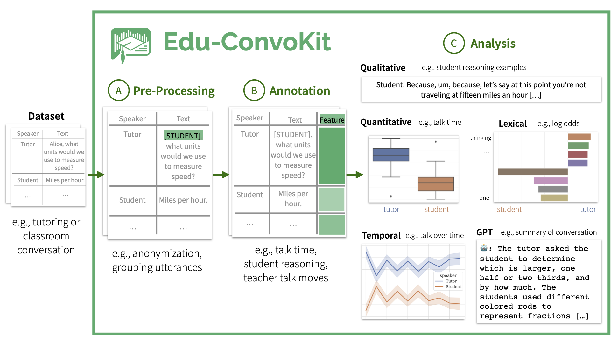
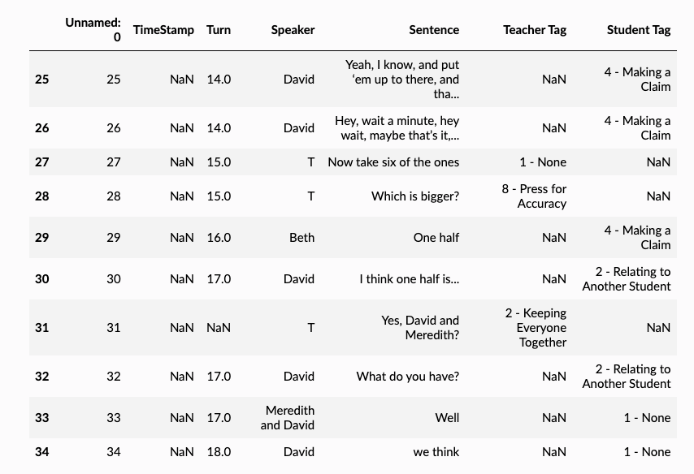
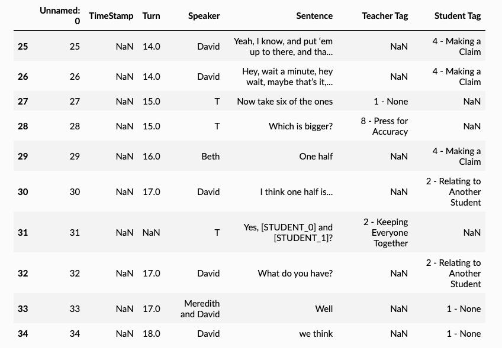
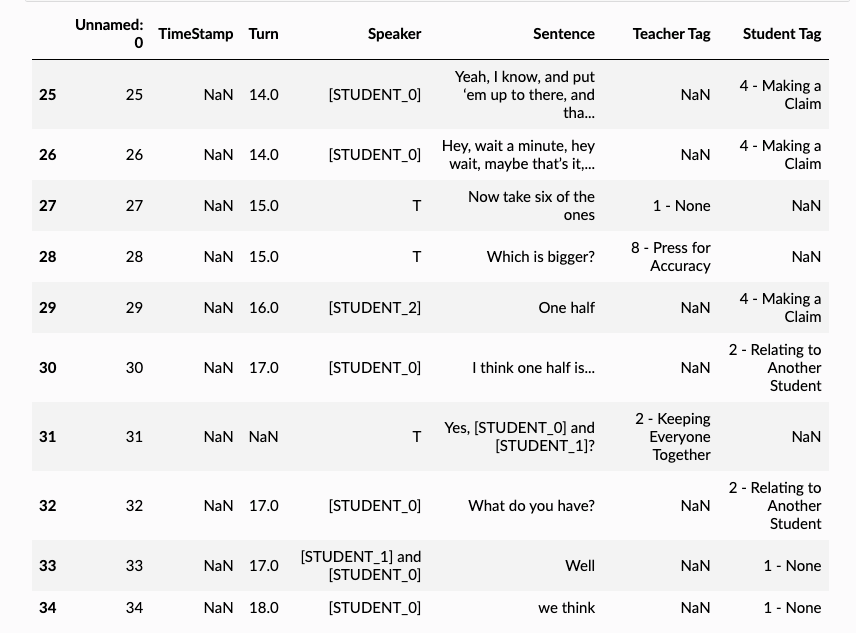

<p align="center">
  
</p>

<h1> Edu-ConvoKit: An Open-Source Framework for Education Conversation Data </h1>

The **Edu-ConvoKit** is an open-source framework designed to facilitate the study of conversation language data in educational settings.
It provides a practical and efficient pipeline for essential tasks such as text pre-processing, annotation, and analysis, tailored to meet the needs of researchers and developers.
This toolkit aims to enhance the accessibility and reproducibility of educational language data analysis, as well as advance both natural language processing (NLP) and education research.
By simplifying these key operations, the Edu-ConvoKit supports the efficient exploration and interpretation of text data in education.

## 📖 Table of Contents
[**Installation**](#installation) | [**Tutorials**](#tutorials) | [**Example Usage**](#example-usage) | [**Documentation**](https://edu-convokit.readthedocs.io/en/latest/) | [**Papers with Edu-ConvoKit**](papers.md) | [**Citation**](#citation) | [**Contact**](#contact)

## Installation

You can directly install the `edu-convokit` from GitHub:

```bash

pip install edu-convokit

```

## Overview of the `edu-convokit` Pipeline

The **Edu-ConvoKit** pipeline consists of three key modules: `preprocess`, `annotate`, and `analyze`.
The pipeline is designed to be modular, so you can use any combination of these modules to suit your needs.
This pipeline has also been used by prior work in the field of education, so you can easily reproduce their results. 

<p align="center">
  
</p>

## Tutorials

We have provided a series of tutorials to help you get started with the `edu-convokit`.

### Basics of `edu-convokit`

There are three key modules of the `edu-convokit` pipeline: `preprocess`, `annotate`, and `analyze`.

* [][textcolab] [Tutorial: Text Pre-processing][textcolab]
* [][annotationcolab] [Tutorial: Annotation][annotationcolab]
* [][analyzecolab] [Tutorial: Analysis][analyzecolab]
...

### Datasets with `edu-convokit`

We've applied the `edu-convokit` to a variety of datasets. Here are some examples:
* [][nctecolab] [Tutorial: NCTE Dataset][nctecolab]
* [][ambercolab] [Tutorial: Amber Dataset][ambercolab]
* [][talkmovescolab] [Tutorial: Talk Moves Dataset][talkmovescolab]


## Example Usage

### Pre-Processing

The `preprocess` module provides a set of tools for cleaning and formatting raw text data. Text pre-processing is a critical step in handling education language data. 
- It ensures the data is clean (education data is notoriously messy). 
- It ensures the data is standardized, ready for annotation and analysis. 
- It ensures that the students and educators are anonymized; this is important to protect the privacy of individuals involved and allow for safe secondary data analysis.

Here's an example of using `preprocess` to anonymize the dataset with known names:

```python 

>> from edu_toolkit.preprocessors import TextPreprocessor
# For helping us flexibly load data
>> from edu_toolkit import utils

# First get the data
>> !wget "https://raw.githubusercontent.com/rosewang2008/edu-toolkit/master/data/talkmoves/Boats and Fish 2_Grade 4.xlsx"
>> data_fname = "Boats and Fish 2_Grade 4.xlsx"
>> df = utils.load_data(data_fname) # Handles loading data from different file types including: .csv, .xlsx, .json

# Show some lines that contain names in the speaker and text columns.
>> df.iloc[25:35]
```

<p align="center">
  
</p>

💡 Note: We see that the names occur in the speaker and text column. 
- e.g., names like David and Meredith appear in the speaker and text column. 
- The teacher is always shortened to “T” in the speaker column.

We can use the `TextPreprocessor` to anonymize the data in both columns.

```python

# Creating variables for the columns we want to use
>> TEXT_COLUMN = "Sentence"
>> SPEAKER_COLUMN = "Speaker"

# Show the names of the speakers. In your use case, you might load this from a file or database.
>> print(df[SPEAKER_COLUMN].unique())
['T' 'David' 'Meredith' 'Beth' 'Meredith and David' 'T 2']

# Create list of names and replacement names. We will make the replacement names unique so that we can easily find them later.
>> known_names = ["David", "Meredith", "Beth"]
>> known_replacement_names = [f"[STUDENT_{i}]" for i in range(len(known_names))]
>> print(known_replacement_names)
['[STUDENT_0]', '[STUDENT_1]', '[STUDENT_2]']

# Now let's anonymize the names in the text!
>> processor = TextPreprocessor()
>> df = processor.anonymize_known_names(
    df=df,
    text_column=TEXT_COLUMN,
    names=known_names,
    replacement_names=known_replacement_names,
    # We will directly replace the names in the text column.
    # If you want to keep the original text, you can set `target_text_column` to a new column name.
    target_text_column=TEXT_COLUMN
)
>> df.iloc[25:35]
```

<p align="center">
  
</p>

💡 Note: Nice, we can see that the text has been anonymized (e.g., line 31)! Now let's anonymize the names in the speaker column.

```python

df = processor.anonymize_known_names(
    df=df,
    text_column=SPEAKER_COLUMN,
    names=known_names,
    replacement_names=known_replacement_names,
    target_text_column=SPEAKER_COLUMN
)

df.iloc[25:35]
```

<p align="center">
  
</p>

🎉 Great, now we have anonymized the speaker names as well! Some other great things are that: 
- We have a record of the original names and the anonymized names. So if we want to go back to the original names, we can do that. 
- The anonymized names are consistent: So [STUDENT_0] in the SPEAKER_COLUMN will refer to the same [STUDENT_0] in the TEXT_COLUMN.


## Papers that have used the `edu-convokit`

Please find [here](papers.md) a list of papers that have used the `edu-convokit`.

## Citation

If you use the `edu-convokit` in your research, please cite the following paper:

```
Coming soon...
```

If you would like to be added to the list of papers that have used the `edu-convokit`, please make a pull request or contact Rose E. Wang at rewang@cs.stanford.edu.

[textcolab]: https://colab.research.google.com/drive/1a-EwYwkNYHSNcNThNTXe6DNpsis0bpQK
[annotationcolab]: https://colab.research.google.com/drive/1rBwEctFtmQowZHxralH2OGT5uV0zRIQw 
[analyzecolab]: https://colab.research.google.com/drive/1xfrq5Ka3FZH7t9l87u4sa_oMlmMvuTfe 
[ambercolab]: https://colab.research.google.com/drive/1Q3anUPcemMils4cz2gwEwDdKCjEdm6T9 
[talkmovescolab]: https://colab.research.google.com/drive/1qt_S3GjxIwXk6ONztbYAHeX8WHy1uxDd 
[nctecolab]: https://colab.research.google.com/drive/1k3fn6uY4QRMtPUZN6hpMd6o-0g7fYotg 


## Contact

If you have any questions, please contact Rose E. Wang at rewang@cs.stanford.edu.